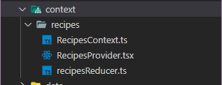

# Prueba

- Link proyecto [Página](https://test-kevin.netlify.app/)

- Agregue el `ReactContext` solo para exponer la sección de nuevas recetas.
 

- Iniciar proyecto en local 
<ol>
  <li>Crear archivo .env en la raiz del proyecto</li>
  <li>Agregar la variable de entorno con el nombre REACT_APP_API_KEY con el valor de la apiKey del servicio de recetas</li>
  <li>Ejecutar el comando 'npm i' o 'yarn install'</li>
  <li>Por último ejecutar el comando 'npm run start' o 'yarn start'</li>

</ol>